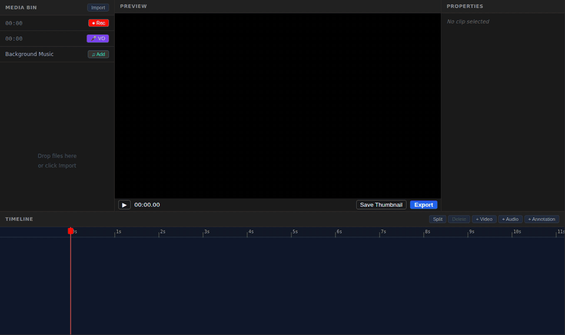
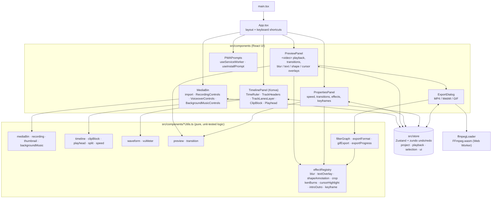
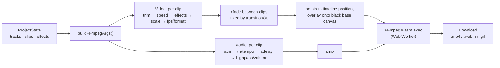

# Cutlass

A browser-based video editor built for screen recordings. Record your screen, trim and arrange clips on a multi-track timeline, add effects and annotations, then export — all without leaving the browser.

**Live demo:** https://videoeditor-app.netlify.app



## Features

**Recording**

- Screen capture with system audio via `getDisplayMedia()`
- Voiceover recording with separate audio track
- Cursor position tracking for replay highlighting
- Pause/resume support with recording timer

**Timeline Editing**

- Multi-track canvas timeline (video, audio, annotation tracks)
- Drag-to-move, trim handles, split at playhead
- Per-clip speed control (0.25x–4x)
- Track mute/lock, volume, and noise reduction
- Snapping, zoom from frame-level to minutes
- Undo/redo with full history

**Effects & Annotations**

- Zoom/Pan (Ken Burns) with keyframes
- Blur/redact regions
- Text overlays
- Shape annotations (rectangle, circle, arrow)
- Cursor highlight replay
- Crop per clip
- Transitions (cross-dissolve, fade-to-black, wipe)
- Intro/outro templates
- Keyframe editor with easing curves

**Audio**

- Per-track volume and mute
- Waveform visualization
- Background music track
- Audio level metering
- Noise reduction (high-pass filter)

**Export**

- MP4 (H.264), WebM (VP9), and GIF
- Resolution presets (1080p, 720p, 480p) or custom
- Client-side encoding via FFmpeg.wasm in a Web Worker
- Progress tracking with cancel support

## Tech Stack

React 19 · TypeScript · Vite · Zustand · Konva.js · FFmpeg.wasm · Web Audio API

## Architecture

Everything runs client-side. React components read and write a single Zustand store; the
timeline is drawn on a Konva canvas; export translates the project into an FFmpeg
`filter_complex` graph that FFmpeg.wasm runs in a Web Worker.

### Code structure



### Export pipeline



If a source has no audio stream, export retries using only the audio tracks, then video-only.

### Project layout

| Path                                 | Contents                                                                          |
| ------------------------------------ | --------------------------------------------------------------------------------- |
| `src/App.tsx`                        | App shell (four-panel layout) and global keyboard shortcuts                       |
| `src/store/`                         | Zustand store: project model (`types.ts`), actions, undo/redo history             |
| `src/components/*.tsx`               | React panels and Konva timeline components                                        |
| `src/components/*Utils.ts`           | Pure logic for timeline math, effects, audio and export (each with a `.test.ts`)  |
| `src/components/effectRegistry.ts`   | Effect definitions: defaults, preview rendering data and FFmpeg filters           |
| `src/components/filterGraphUtils.ts` | Converts the project into an FFmpeg `filter_complex` graph                        |
| `src/components/ffmpegLoader.ts`     | Loads FFmpeg.wasm (single-threaded by default, multi-threaded opt-in)             |
| `public/`                            | PWA manifest, service worker, icons; FFmpeg core files are copied here on install |
| `e2e/`                               | Playwright end-to-end export test                                                 |
| `specs/`                             | Feature specifications                                                            |

## Keyboard Shortcuts

| Key                              | Action                        |
| -------------------------------- | ----------------------------- |
| `Space`                          | Play / pause                  |
| `J` / `L`                        | Step one frame back / forward |
| `K`                              | Pause                         |
| `I` / `O`                        | Set in / out point            |
| `S`                              | Split clip(s) at playhead     |
| `Delete` / `Backspace`           | Delete selected clips         |
| `Ctrl/Cmd+Z`, `Ctrl/Cmd+Shift+Z` | Undo / redo                   |

## Getting Started

```bash
npm install
npm run dev
```

## Scripts

| Command            | Description                                 |
| ------------------ | ------------------------------------------- |
| `npm run dev`      | Start dev server                            |
| `npm run build`    | Type-check and build for production         |
| `npm run test`     | Run tests in watch mode                     |
| `npm run test:run` | Run tests once                              |
| `npm run lint`     | Lint with ESLint                            |
| `npm run check`    | Run all checks (types, lint, format, tests) |

## License

MIT
